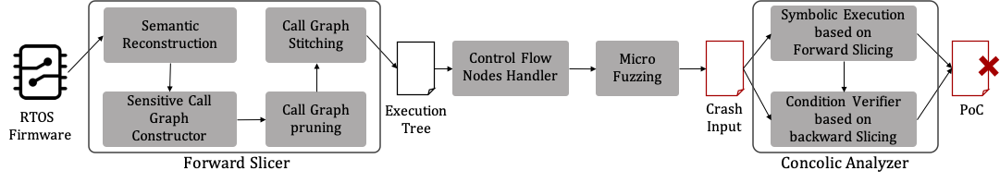

# SFuzz
Implementation(Source code) of paper: SFuzz: Slice-based Fuzzing for Real-Time Operating Systems

## Overview of SFuzz


## Static Analysis
Perform taint analysis on the specified firmware, slice and patch the program for the taint analysis results.

This part uses the firmware collection in the evaluation_set folder as input.

### Instructions for running this tool

1. Download Ghidra (we use version 9.2.3).
2. Change MAXMEM=2G to MAXMEM=4G in the analyzeHeadless file in the support directory of Ghidra folder.
3. `sudo apt install openjdk-11-jdk`
4. Place each file in a specific directory according to run.sh or modify run.sh according to the file location.
5. Run run.sh for a single firmware or run run_all.py for the entire firmware set.

### Directories
```
├── README.md
├── evaluation_set   #  Unpacked firmware collection
├── findtrace_output #  Static analysis results for firmware in evaluation_set
├── findtrace.py     #  Ghidra script that performs taint analysis and outputs slices and patches
├── run.sh           #  Shell scripts for processing individual firmware
├── run_all.py       #  Python script for batch processing of multiple firmware
└── setbase.py       #  Ghidra script for setting the base address for firmware loading
```

### Run

#### For processing individual firmware
**Be sure to modify run.sh according to the actual file location before you run it**
```
sudo ./run.sh firmware_path  arch  base_addr
```
example: 
```
sudo ./run.sh evaluation_set/DIR-100/30_DIR100 MIPS:BE:32:default 0x80000100
```
#### For batch processing of multiple firmware
```
sudo python3 run_all.py
```
#### Output
Most of the files end with an underscore and a number, which represents the number of the call tree corresponding to the current file.
```
30_DIR100_result/
├── call_checksum_0  # Address of checksum function calls
├── .......
├── call_checksum_7
├── calltrace_0      # Results of call trace in call tree
├── ........
├── calltrace_7
├── cbranch_info_0   # Jumping information at the branch
├── ........
├── cbranch_info_7
├── dict_0           # String information on the call tree (used to add to the AFL dictionary)
├── ........
├── dict_7
├── exec_0           # Contextual information used for fuzzing (source address and sink address, etc.)
├── ........
├── exec_7
├── patch_0          # Patch results for function calls or branches
├── ........
├── patch_7
├── sink_buf_0       # Information about the sink function address and its corresponding buffer
├── ........
├── sink_buf_7
├── stack_retaddr_0  # Return address information on the stack
├── ........
├── stack_retaddr_7
├── summary          # Statistical Information
├── summary.json
├── xalloc_0         # Cross-reference information for the alloc function
├── ........
└── xalloc_7
```

## Dynamic Analysis
Dynamic analysis includes fuzzing and concolic solving.

This project relies on the output of the static analysis as input.

### Running environment configuration
Ubuntu:16.04
```bash
pushd ~
sudo apt install -y libc6-armel-cross gcc-arm-linux-gnueabi
sudo apt install -y libc6-mipsel-cross gcc-mipsel-linux-gnu
sudo apt install -y python3-pip git wget python automake python-setuptools # required by afl-unicorn
sudo apt install -y clang-6.0
sudo ln -s `which clang-6.0` /usr/bin/clang
sudo pip3 install --upgrade "pip<21.0.0"
sudo pip3 install pwntools
git clone https://github.com/Battelle/afl-unicorn
pushd ~/afl-unicorn
make
sudo make install
cd unicorn_mode
sudo ./build_unicorn_support.sh
popd 
popd 
```

Also, AFL requires: if in a docker environment, execute with root privileges outside the docker environment, otherwise execute the following statements directly with root privileges.

```bash
echo core > /proc/sys/kernel/core_pattern
```

There are also minor modifications to the dependent projects.

https://amusing-aluminum-be0.notion.site/d0de68137f884c1984d4ae7c762b566f

To get the docker image directly, go to: https://drive.google.com/file/d/1tNDaHhYV_K5ys3M9VoBI_l6oj004too_/view?usp=sharing where the code needs to be updated with a git pull

### build fuzz loader
`make` or `make "UFDBG=-DUF_DEBUG -g"`

### run
in `./dynamic_analysis` dir:

```bash
(in tmux session)
python3 ./hybrid_all.py <device findtrace output dir>  <device firmware path>
```

example:
```bash
python3 ./hybrid_all.py ~/findtrace_output/2834_AC11_result ~/evaluation_set/Tenda_AC11/2834_AC11
```