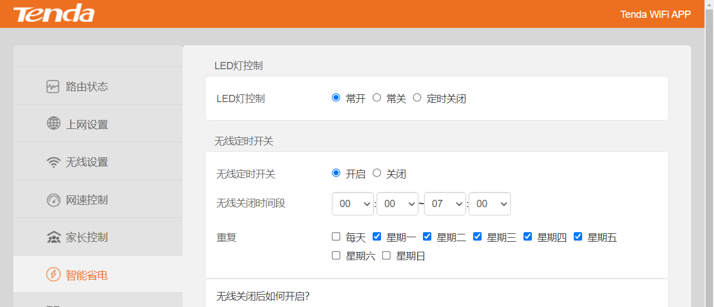
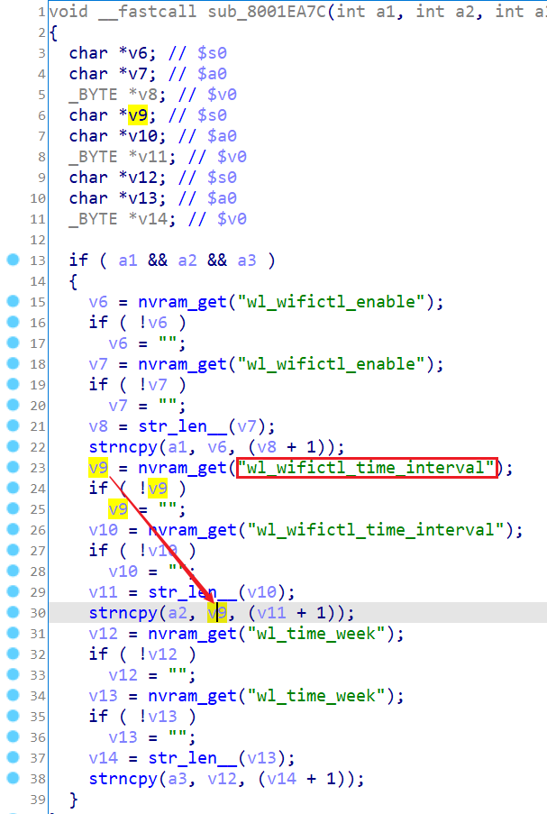
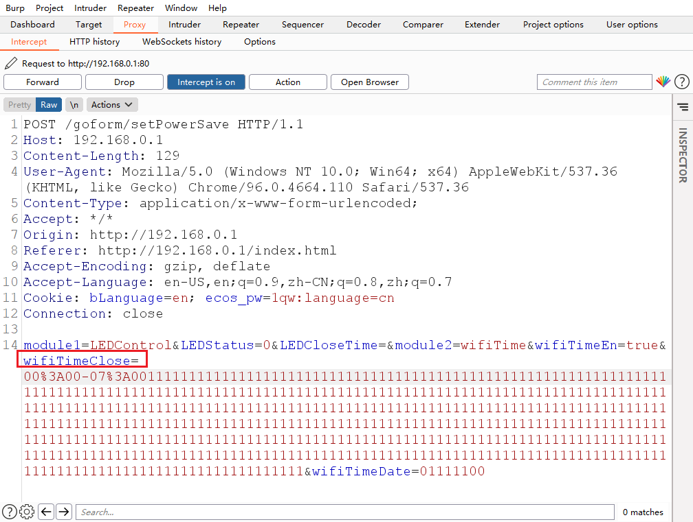

# Tenda Router AC Series Vulnerability

This vulnerability lies in the `/goform/setPowerSave` page which influences the lastest version of Tenda Router AC11. ([AC11_V02.03.01.104_CN](https://www.tenda.com.cn/download/detail-3163.html))

## Vulnerability description

There is a stack buffer overflow vulnerability in the `wifiTime` module.

the program reads user input `wifiTimeClose` into variable `v10` and uses `nvram_set` function to set the nvram variable `wl_wifictl_time_interval`, without porper length check. 

the prograrm will then use `nvram_get` function to put that input into variable `v9` and copy to the parameter `a2`, which will cause a stack overflow.

So by POSTing the page `/goform/setPowerSave` with proper `wifiTimeClose`, the attacker can easily perform a **Deny of Service Attack** or **Remote Code Execution** with carefully crafted overflow data.

## POC

## Timeline

- 2022.01.09 report to CVE & CNVD